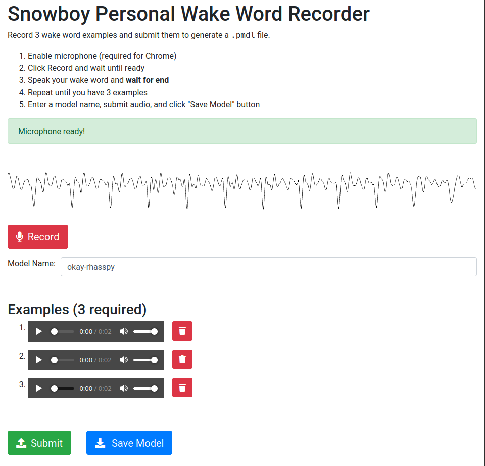

# Snowboy API

Emulate the following API from previously deprecated hotword as a service system.

```
{
    "name": "a word",
    "language": "en",
    "age_group": "10_19",
    "gender": "F",
    "microphone": "mic type",
    "token": "<your auth token>",
    "voice_samples": [
        {wave: "<base64 encoded wave data>"},
        {wave: "<base64 encoded wave data>"},
        {wave: "<base64 encoded wave data>"}
    ]
}
```

References: 

* https://github.com/Kitt-AI/snowboy/#hotword-as-a-service
* http://docs.kitt.ai/snowboy/#api-v1-train


# Forked from Snowboy Personal Wake Word Recorder

Docker-based web interface for generating `.pmdl` files from audio examples for [snowboy](https://github.com/Kitt-AI/snowboy).

Credit to [seasalt-ai](https://github.com/seasalt-ai/snowboy)

## Docker Image

To get started, run the pre-built Docker image:

```sh
$ docker run -it -p 8000:8000 rhasspy/snowboy-seasalt
```

The web interface will now be available at http://localhost:8000

If you'd like to build the Docker image yourself, see `scripts/build-docker.sh`

## Web Interface

Examples can be recorded and submitted directly in a web browser. Once you've enabled your microphone (required by Chrome), each example can be recorded by:

1. Clicking the "Record" button and waiting until it's ready
2. Speaking the wake word and then quietly waiting until it's done

The timeouts here are used to avoid needing to trim out button clicks from the audio.

Once you have 3 examples, click "Submit" and you should see a "Save Model" button appear. Save the `.pmdl` file somewhere and enjoy your new wake word!



Audio visualization is provided by [wavesurfer-js](https://wavesurfer-js.org/)

## HTTP API

You can also `POST` your audio examples to the web server directly and get a `.pmdl` file back!

The `/generate` endpoint expects form data with:

* A `modelName` field with your wake word name
* At least 3 files with audio samples
    * These will be converted to the appropriate format with `ffmpeg`
    * Unless `?noTrim=true` is given, silence is automatically trimmed from the beginning and end of each example

```sh
$ curl \
    -X POST \
    -F modelName=okay-rhasspy \
    -F example1=@example1.wav \
    -F example2=@example2.wav \
    -F example3=@example3.wav \
    --output okay-rhasspy.pmdl \
    localhost:8000/generate
```
